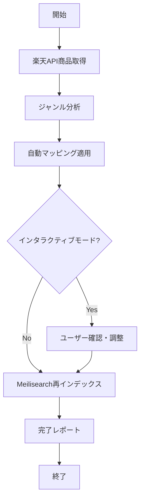

# UchiGift 商品データ自動更新システム

## 概要
楽天API商品取得からMeilisearch再インデックスまでを完全自動化するワンストップソリューション

## 機能
1. 🚀 **楽天API商品取得** - 新商品データの自動収集
2. 🔍 **ジャンル分析** - 未分類ジャンルの自動検出
3. 🤖 **自動マッピング** - AIによる分類候補の自動適用
4. 🎨 **インタラクティブ調整** - ユーザー確認による精度向上
5. 📚 **自動再インデックス** - Meilisearchの自動更新

## クイックスタート

### 完全自動実行（推奨）
```bash
python auto_update_products.py
```

### その他の実行オプション
```bash
# 既存データで更新（楽天API取得スキップ）
python auto_update_products.py --no-fetch

# インタラクティブモードなし（完全自動）
python auto_update_products.py --no-interactive

# 取得件数指定
python auto_update_products.py --max-items 10000

# 既存データ + 完全自動
python auto_update_products.py --no-fetch --no-interactive
```

## 実行フロー



## 必要な前提条件

1. **設定ファイル**: `config.py` に楽天API設定
2. **Meilisearchサーバー**: `http://127.0.0.1:7700` で稼働
3. **依存スクリプト**:
   - `fetch_rakuten_products.py`
   - `analyze_genres.py` 
   - `index_meili_products.py`
4. **設定ファイル**: `data/genre_mapping_rules.json`

## 出力ファイル

- **商品データ**: `data/rakuten_uchiwai_products_YYYYMMDD_HHMMSS.json`
- **ジャンルキャッシュ**: `data/genre_cache.json`
- **マッピングルール**: `data/genre_mapping_rules.json`
- **実行ログ**: リアルタイム出力 + ファイルログ

## トラブルシューティング

### よくあるエラー

1. **楽天API接続エラー**
   - `config.py` の API キーを確認
   - ネットワーク接続を確認

2. **Meilisearchエラー**
   - Meilisearchサーバーの起動確認: `docker compose up -d`
   - ポート7700の利用可能性確認

3. **分析ファイル不足**
   - 必要なスクリプトファイルの存在確認
   - `data/` ディレクトリの作成確認

### デバッグ方法

1. **個別ステップ実行**:
   ```bash
   # 楽天API取得のみ
   python fetch_rakuten_products.py
   
   # ジャンル分析のみ
   python analyze_genres.py
   
   # インデックス更新のみ
   python index_meili_products.py --source rakuten --file data/latest_file.json
   ```

2. **ログ確認**: 実行時のタイムスタンプ付きログを確認

## パフォーマンス

- **実行時間**: 約10-15分（5000件、ネットワーク速度による）
- **メモリ使用量**: 約100-200MB
- **ディスク容量**: 約50-100MB（データファイル）

## 今後の拡張予定

- [ ] Amazon/Yahoo!ショッピング対応
- [ ] スケジュール自動実行（cron対応）
- [ ] Slack/メール通知機能
- [ ] エラー時の自動リトライ機能
- [ ] 分類精度の機械学習向上

## 貢献・フィードバック

新しいジャンル分類や機能改善の提案は Issues でお知らせください。